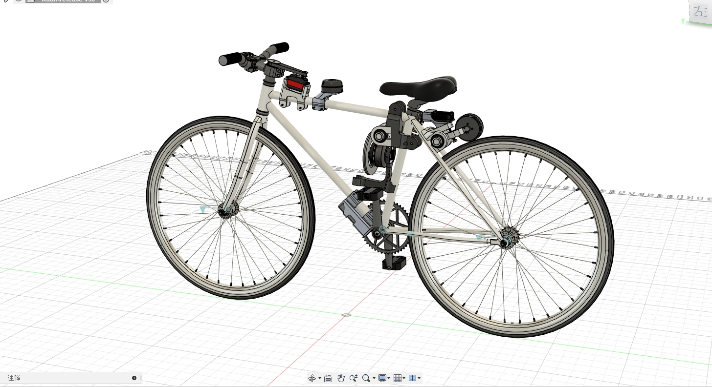

<h1 align="center">XUAN</h1>

<i>bicycle into a self-driving car!</i>

  
<!--  -->

<i>Loved the project? Please consider giving a Star ⭐️ to help it improve!</i>

---

> Project video: [[Self-made] I made the bicycle into a self-driving car! ! [Hardcore]](https://www.bilibili.com/video/BV1fV411x72a)

## file description

Inside `Hardware` is the PCB file of the controller, including the reference scheme of the carrier board of the Ascend A200 module. The MCU is based on ESP32, equipped with MPU6050, and connected to the driver through the CAN bus.

`Structure` contains the body structure design file. The step is exported by Fusion. There may be some bugs. It is recommended to directly download the Fusion360 project and open it in the software: https://a360.co/2TOtZRd

The software part has not been released for the time being because the coupling of the FOC driver is not universal, but I will open source a mini simplified version of the bicycle complete solution (using a small DC motor) including the source code later, you can wait for a while.

In addition, I am sorting out a robot embedded development framework (REF), which will abstract some tools and development modes commonly used in robot development, and will also update a warehouse separately at that time.
